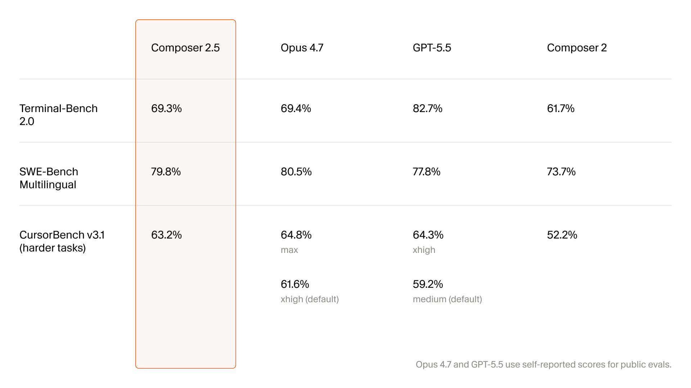

# agiscore

Side-by-side benchmark leaderboard for frontier coding agents.

Snapshot from Cursor's **Composer 2.5** launch (May 2026), comparing
Composer 2.5 against Anthropic Opus 4.7, OpenAI GPT-5.5, and the previous
Composer 2.

## Results

| Benchmark | Composer 2.5 | Opus 4.7 | GPT-5.5 | Composer 2 |
|---|---|---|---|---|
| Terminal-Bench 2.0 | **69.3%** | 69.4% | 82.7% | 61.7% |
| SWE-Bench Multilingual | **79.8%** | 80.5% | 77.8% | 73.7% |
| CursorBench v3.1 (harder tasks) | **63.2%** | 64.8% (max) / 61.6% (xhigh default) | 64.3% (xhigh) / 59.2% (medium default) | 52.2% |

> Opus 4.7 and GPT-5.5 use self-reported scores for public evals.

## View

Open `index.html` in a browser, or browse via GitHub Pages once enabled.
